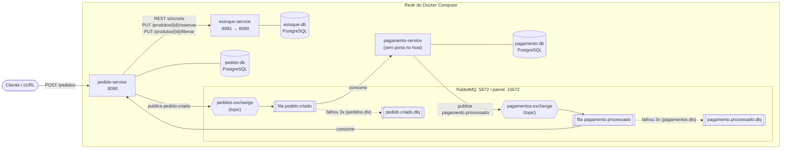
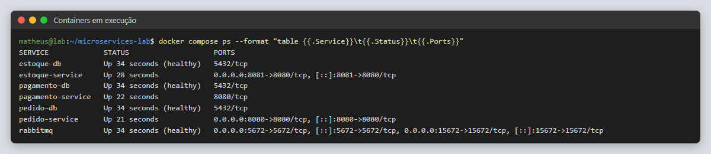
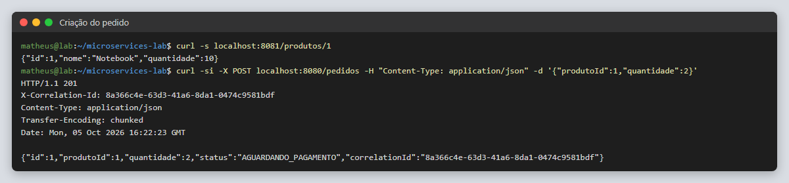
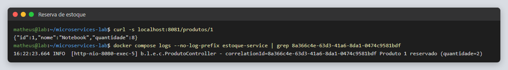
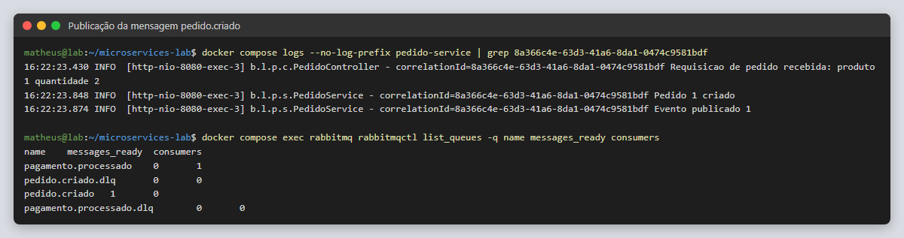
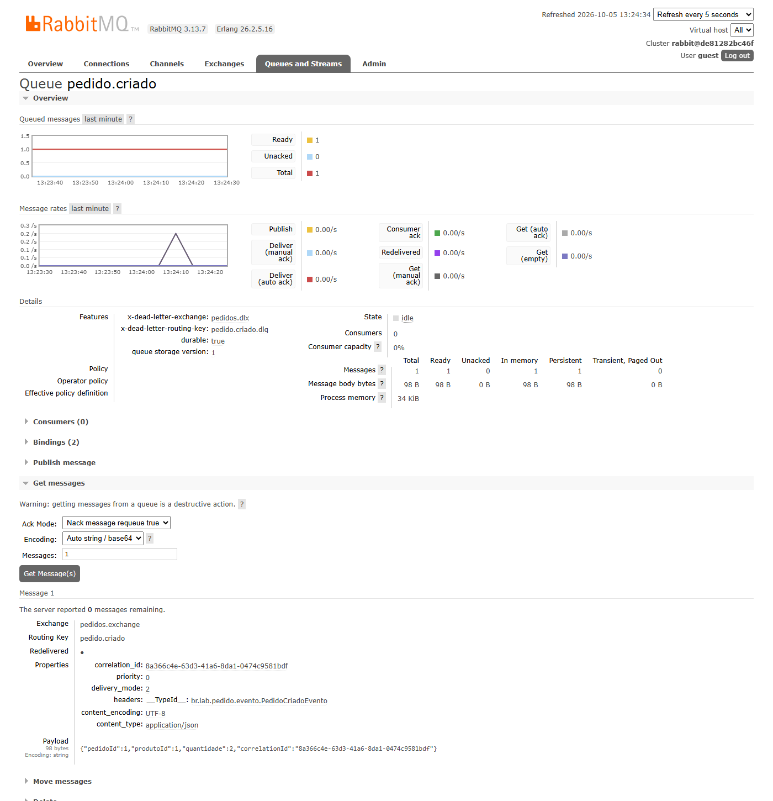
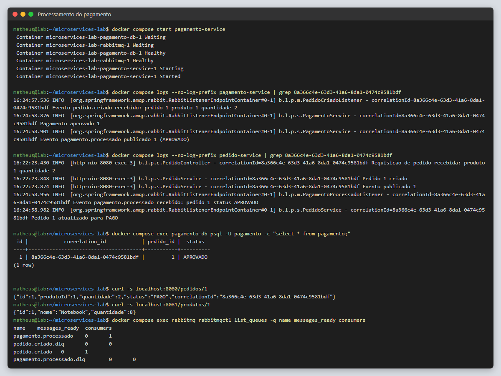
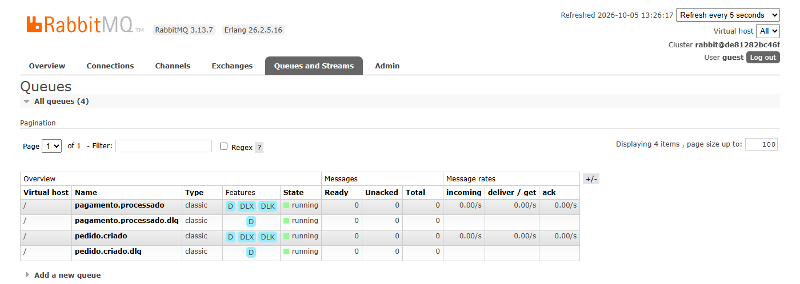

# Entrega — Plataforma de E-commerce com Microsserviços

**Estudantes**

| Nome | Matrícula |
|---|---|
| Matheus Augusto Ferreira Medeiros | 202305532 |
| Marcello Ronald José da Silva | 202302618 |

**Repositório:** https://github.com/matheusaugustodev/padroes-arquitetura-ufg-microsservicos

**Tecnologias:** Java 17, Spring Boot 3.3, PostgreSQL 16 (um banco por serviço), RabbitMQ 3.13 e Docker Compose.

---

## Parte 1 — Diagrama da arquitetura



**Como o fluxo funciona**

1. O cliente envia `POST /pedidos`. O **Pedido Service** gera um `correlationId` único para a requisição.
2. O Pedido chama o **Estoque Service** por REST (comunicação **síncrona**) para reservar a quantidade. Se não houver estoque (409) ou o produto não existir (404), o pedido não é criado e nenhum evento é publicado.
3. Com a reserva feita, o Pedido grava o pedido no **próprio banco** com status `AGUARDANDO_PAGAMENTO` e publica o evento `pedido.criado` no RabbitMQ (comunicação **assíncrona**).
4. O **Pagamento Service** consome o evento, aprova cerca de 80% dos pagamentos, grava o resultado no **próprio banco** e publica `pagamento.processado`.
5. O Pedido consome esse evento e muda o status para `PAGO` ou `REJEITADO`. Quando o pagamento é rejeitado, o Pedido devolve a quantidade ao estoque (compensação).

Cada serviço tem seu próprio banco, e nenhum serviço acessa o banco de outro (*database per service*). O `correlationId` é enviado no header `X-Correlation-Id` das chamadas REST e na propriedade `correlation_id` das mensagens, o que permite rastrear um pedido nos logs dos três serviços.

---

## Parte 2 — Código-fonte dos serviços

O código completo está no repositório: https://github.com/matheusaugustodev/padroes-arquitetura-ufg-microsservicos

```
microservices-lab/
├── docker-compose.yml
├── pedido-service/                     # API de pedidos (porta 8080)
│   ├── Dockerfile
│   ├── pom.xml
│   └── src/main/java/br/lab/pedido/
│       ├── controller/PedidoController.java        # POST/GET /pedidos, gera o correlationId
│       ├── service/PedidoService.java              # reservar → criar → publicar; compensação; atualização de status
│       ├── client/EstoqueClient.java               # chamada REST ao Estoque
│       ├── messaging/PagamentoProcessadoListener.java
│       ├── config/RabbitConfig.java, RestConfig.java
│       ├── model/Pedido.java, StatusPedido.java
│       ├── evento/, dto/, exception/, repository/
│       └── PedidoApplication.java
├── estoque-service/                    # Estoque (porta 8081)
│   ├── Dockerfile
│   ├── pom.xml
│   └── src/main/java/br/lab/estoque/
│       ├── controller/ProdutoController.java       # GET /produtos, PUT /reservar, PUT /liberar
│       ├── repository/ProdutoRepository.java       # UPDATE atômico com "quantidade >= :qtd"
│       ├── config/DadosIniciais.java               # produtos iniciais (Notebook, Mouse, Teclado)
│       ├── model/, dto/
│       └── EstoqueApplication.java
└── pagamento-service/                  # Pagamento (somente rede interna)
    ├── Dockerfile
    ├── pom.xml
    └── src/main/java/br/lab/pagamento/
        ├── messaging/PedidoCriadoListener.java     # consome pedido.criado
        ├── service/PagamentoService.java           # aprova ~80%, idempotente, publica o resultado
        ├── config/RabbitConfig.java                # exchanges, filas e DLQs
        ├── model/, evento/, repository/
        └── PagamentoApplication.java
```

**Endpoints**

| Serviço | Método e rota | Descrição |
|---|---|---|
| Pedido | `POST /pedidos` | Cria o pedido (`{"produtoId":1,"quantidade":2}`) |
| Pedido | `GET /pedidos`, `GET /pedidos/{id}` | Lista ou consulta pedidos |
| Estoque | `GET /produtos`, `GET /produtos/{id}` | Lista ou consulta produtos |
| Estoque | `PUT /produtos/{id}/reservar` | Reserva a quantidade (200, 404 ou 409) |
| Estoque | `PUT /produtos/{id}/liberar` | Devolve uma reserva (compensação) |

---

## Parte 3 — Arquivo `docker-compose.yml`

```yaml
services:
  rabbitmq:
    image: rabbitmq:3.13-management
    ports:
      - "5672:5672"
      - "15672:15672"   # painel: http://localhost:15672 (guest/guest)
    healthcheck:
      test: ["CMD", "rabbitmq-diagnostics", "-q", "ping"]
      interval: 10s
      timeout: 5s
      retries: 10

  estoque-db:
    image: postgres:16
    environment:
      POSTGRES_DB: estoque
      POSTGRES_USER: estoque
      POSTGRES_PASSWORD: estoque
    volumes:
      - estoque-data:/var/lib/postgresql/data
    healthcheck:
      test: ["CMD-SHELL", "pg_isready -U estoque -d estoque"]
      interval: 5s
      timeout: 3s
      retries: 10

  pedido-db:
    image: postgres:16
    environment:
      POSTGRES_DB: pedido
      POSTGRES_USER: pedido
      POSTGRES_PASSWORD: pedido
    volumes:
      - pedido-data:/var/lib/postgresql/data
    healthcheck:
      test: ["CMD-SHELL", "pg_isready -U pedido -d pedido"]
      interval: 5s
      timeout: 3s
      retries: 10

  pagamento-db:
    image: postgres:16
    environment:
      POSTGRES_DB: pagamento
      POSTGRES_USER: pagamento
      POSTGRES_PASSWORD: pagamento
    volumes:
      - pagamento-data:/var/lib/postgresql/data
    healthcheck:
      test: ["CMD-SHELL", "pg_isready -U pagamento -d pagamento"]
      interval: 5s
      timeout: 3s
      retries: 10

  estoque-service:
    build: ./estoque-service
    ports:
      - "8081:8080"
    environment:
      SPRING_DATASOURCE_URL: jdbc:postgresql://estoque-db:5432/estoque
      SPRING_DATASOURCE_USERNAME: estoque
      SPRING_DATASOURCE_PASSWORD: estoque
    depends_on:
      estoque-db:
        condition: service_healthy

  pedido-service:
    build: ./pedido-service
    ports:
      - "8080:8080"
    environment:
      SPRING_DATASOURCE_URL: jdbc:postgresql://pedido-db:5432/pedido
      SPRING_DATASOURCE_USERNAME: pedido
      SPRING_DATASOURCE_PASSWORD: pedido
      SPRING_RABBITMQ_HOST: rabbitmq
      ESTOQUE_SERVICE_URL: http://estoque-service:8080
    depends_on:
      pedido-db:
        condition: service_healthy
      rabbitmq:
        condition: service_healthy
      estoque-service:
        condition: service_started

  pagamento-service:
    build: ./pagamento-service
    # Sem "ports": nenhuma porta fixa no host, o que permite --scale pagamento-service=2
    expose:
      - "8080"
    environment:
      SPRING_DATASOURCE_URL: jdbc:postgresql://pagamento-db:5432/pagamento
      SPRING_DATASOURCE_USERNAME: pagamento
      SPRING_DATASOURCE_PASSWORD: pagamento
      SPRING_RABBITMQ_HOST: rabbitmq
      # Investigacao de incidente: descomente para fazer o pagamento do pedido 17 falhar
      # SIMULACAO_FALHAR_PEDIDO_ID: "17"
    depends_on:
      pagamento-db:
        condition: service_healthy
      rabbitmq:
        condition: service_healthy

volumes:
  estoque-data:
  pedido-data:
  pagamento-data:
```

---

## Parte 4 — Prints

Todos os prints vêm de uma mesma execução, feita em 05/10/2026, e acompanham **um único pedido**, o pedido 1, com `correlationId = 8a366c4e-63d3-41a6-8da1-0474c9581bdf`. Para que a mensagem pudesse ser vista na fila antes de ser consumida, o `pagamento-service` foi parado antes da criação do pedido e religado depois.

### Ambiente em execução



### 4.1 Criação do pedido

O estoque do produto 1 (Notebook) começa com 10 unidades. O `POST /pedidos` responde **201 Created** com o header `X-Correlation-Id`, e o pedido fica com status `AGUARDANDO_PAGAMENTO`.



### 4.2 Reserva de estoque

Depois do pedido, o produto 1 passa de 10 para **8** unidades. O log do Estoque Service, filtrado pelo correlationId, registra a reserva feita pela chamada REST do Pedido Service.



### 4.3 Publicação da mensagem

O log do Pedido Service mostra a sequência *requisição recebida → pedido criado → evento publicado*. Com o Pagamento parado, a fila `pedido.criado` mostra 1 mensagem pronta e 0 consumidores.



No painel do RabbitMQ, a fila `pedido.criado` mostra a mensagem com exchange `pedidos.exchange`, routing key `pedido.criado`, `correlation_id` e o payload JSON do evento:



### 4.4 Processamento do pagamento

Quando o Pagamento Service volta, ele consome a mensagem pendente, aprova o pagamento, grava o resultado no banco `pagamento-db` e publica `pagamento.processado`. O Pedido Service recebe esse evento e muda o pedido 1 para **PAGO**. As filas ficam vazias.





---

## Parte 5 — Respostas das perguntas das etapas

> **Pendente:** o enunciado recebido não trazia o texto das perguntas. As respostas abaixo seguem as etapas do roteiro e explicam o que foi feito e observado em cada uma. Conferir com as perguntas exatas do enunciado antes de entregar.

### Etapa 1 — Estoque Service

O serviço expõe a consulta de produtos e a reserva de estoque. A reserva usa um único `UPDATE ... SET quantidade = quantidade - :qtd WHERE id = :id AND quantidade >= :qtd`. Por ser uma única instrução atômica no banco, duas reservas simultâneas não deixam o estoque negativo. A API devolve **200** quando reserva, **409** quando o estoque é insuficiente e **404** quando o produto não existe.

### Etapa 2 — Pedido Service e comunicação síncrona

O Pedido chama o Estoque por **REST síncrono** e só continua depois da resposta. A vantagem é saber na hora se há estoque e responder ao cliente com o erro certo (404 ou 409). A desvantagem é o **acoplamento temporal**: se o Estoque estiver fora do ar, o Pedido não consegue criar pedidos e responde 503.

### Etapa 3 — Regra de negócio e consistência

A ordem é: **reservar estoque → criar pedido → publicar evento**. Se a reserva falha, nada é criado nem publicado. A reserva e a criação do pedido acontecem em serviços e bancos diferentes, então **não existe uma transação única** que cubra as duas.

No experimento (`simularFalha=true`), o sistema falha depois da reserva e antes de gravar o pedido:

- **Sem compensação** (`compensar=false`), o estoque diminui, mas nenhum pedido existe. O resultado é uma inconsistência entre os serviços.
- **Com compensação**, que é o comportamento padrão, o Pedido chama `PUT /produtos/{id}/liberar` e a quantidade volta ao valor original.

Essa é a ideia do padrão **Saga**: cada passo tem uma ação que o desfaz. Ainda resta uma janela de falha entre gravar o pedido e publicar o evento, que poderia ser resolvida com o padrão **Transactional Outbox**.

### Etapa 4 — O Pedido consegue acessar o Estoque?

Sim. No Docker Compose, todos os containers ficam na mesma rede, e o nome do serviço funciona como hostname pelo DNS interno. O Pedido usa `ESTOQUE_SERVICE_URL=http://estoque-service:8080`, que é a porta interna do container, e não a 8081 do host. O comando `docker compose exec pedido-service getent hosts estoque-service` mostra essa resolução de nome.

### Etapa 5 — RabbitMQ

O Pedido publica na exchange `pedidos.exchange` (do tipo *topic*) com a routing key `pedido.criado`. Um binding encaminha a mensagem para a fila durável `pedido.criado`, e as mensagens são persistentes (`delivery_mode: 2`, visível no print 4.3). O Pedido e o Pagamento declaram a mesma fila. Assim, ela existe e guarda mensagens mesmo que o Pagamento nunca tenha sido iniciado.

### Etapas 6 e 7 — Pagamento Service e fluxo completo

O Pagamento consome `pedido.criado`, simula o gateway com 1 segundo de espera e aprova cerca de 80% dos pagamentos. Ele grava o resultado no **próprio banco** e publica `pagamento.processado`. O processamento é **idempotente**: se a mesma mensagem chegar duas vezes, o pagamento não é cobrado de novo, e o resultado já salvo é reenviado. O fluxo completo aparece na Parte 4.

### Etapa 8 — Falha do Pagamento

Com o `pagamento-service` parado, os pedidos **continuam sendo criados**. O Pedido não depende do Pagamento para responder ao cliente. As mensagens se acumulam na fila `pedido.criado` (Ready = N, Consumers = 0) e os pedidos ficam em `AGUARDANDO_PAGAMENTO`. Esse é o benefício do **desacoplamento** dado pela comunicação assíncrona. O print 4.3 mostra exatamente esse estado.

### Etapa 9 — Recuperação

Quando o Pagamento volta, ele consome todas as mensagens pendentes e nenhum pedido se perde, porque a fila é durável e as mensagens são persistentes. A fila volta a Ready = 0, como no print 4.4, onde a mensagem do pedido 1, que esperava na fila, foi processada assim que o serviço subiu.

### Etapa 10 — Escalabilidade

Com `docker compose up -d --scale pagamento-service=2`, duas instâncias consomem a mesma fila no modelo *competing consumers*. O RabbitMQ distribui as mensagens entre elas, e cada mensagem é processada por apenas uma instância. O `prefetch=1` faz cada instância pegar uma mensagem por vez, o que equilibra a carga. O Pagamento não publica porta no host, só `expose`, justamente para permitir várias réplicas sem conflito de porta.

### Etapa 11 — Investigação de incidente (Pedido #17)

Cada requisição recebe um `correlationId`, que segue nos headers REST e nas mensagens. Com ele, basta um `grep` nos logs dos três serviços para reconstruir a história do pedido. Na simulação, o pagamento do pedido 17 falha. O consumidor tenta 3 vezes e, sem sucesso, a mensagem vai para a **Dead Letter Queue** `pedido.criado.dlq`, em vez de ficar em loop infinito. O pedido fica em `AGUARDANDO_PAGAMENTO`, e a mensagem continua guardada na DLQ para análise e reprocessamento.

### Etapa 12 — Status assíncrono

O Pagamento publica `pagamento.processado` e o Pedido atualiza o status para `PAGO` ou `REJEITADO`, sem acessar o banco do Pagamento. A atualização só vale para pedidos ainda em `AGUARDANDO_PAGAMENTO`, então um evento duplicado é ignorado. Quando o pagamento é rejeitado, o Pedido executa uma **compensação de negócio** e devolve a quantidade ao estoque.
